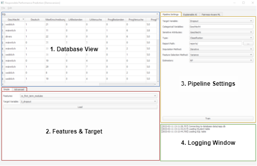
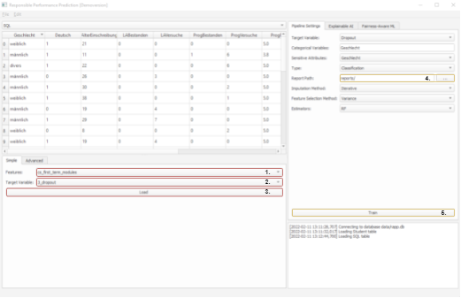

# GUI Manual

This manual will provide information for the Graphical User Interface, part of the RAPP Prediction Package.

The purpose of this manual is to give background information on how the GUI operates, and showcase some use cases. The GUI, consists of four main components:

1. __Database View:__ In this section, the different tables of the database as well as the selected dataset are visualized.
2. __Features & Target:__ In this section the user can generate the dataset used for the predictions, by selecting the features and target variable from a predetermined set, or by writing an SQL query (Advanced).
3. __Pipeline Settings:__ This section enables the user to modify the various settings used in the pipeline, and select the directory in which the generated reports and models are saved.
4. __Logging Window:__ Important process events, such as changes in state, warnings, or errors, are shown in this section.

## Use case: Training models and generating a performance report
This short tutorial will showcase how to use the GUI in order to train models and generate a performance report. 

1. Select a group of features to be used.
2. Select the target variable.
3. Load the selected features and target variable.
4. Select the directory in which the reports and models are saved, the default directory is `reports/`.
5. Train the selected estimators and generate the performance report.
